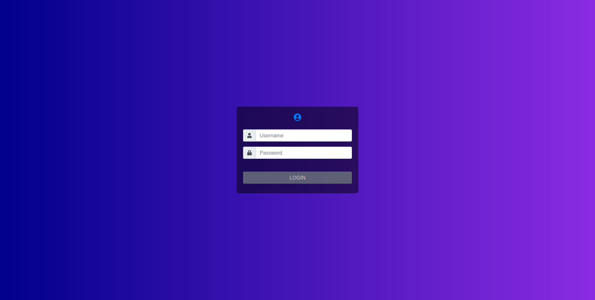

# Introduction

At Dynatrace we used technologies like GWT and Angular to develop user interfaces in the past. With the advent of the Dynatrace Platform, React was picked as the frontend framework of choice for building user interfaces. Software at Dynatrace was already well tested, but with this switch of technologies new concepts, which were popularized within the React community by the use of React Testing Library, got adopted and helped us in writing even more stable, user-focused and developer-friendly tests. So our main goal for writing this blog post was to help the developers to learn writing tests for React apps quicker with the additional benefit of writing well-tested software: providing the devs a good night's sleep.

# Getting started with testing React apps ⚛️

**Disclaimer:** We are by no means experts on testing React components and hooks, but we wanted to share the knowledge we gained during our own research, and we really appreciate any feedback to improve this article.

## What this blog is trying to achieve

This blog post is intended to give you a shortcut on how to test React components and hooks. It covers the approach and the thinking behind how to write component tests and highlights some best practices and caveats. There are many different resources in the area of testing React components and hooks, however this blog post should present our findings on our own journey of testing React apps and summarize our insights while researching this topic.

## What this article is not

This blog post is not meant to be a primer on React. Some basics on writing functional React components with React Hooks are required. If you are completely new to React and want to have an intro to React Hooks first, please refer to [the official React Hooks docs](https://reactjs.org/docs/hooks-intro.html).
Also, this blog post does not cover all the details on Jest, which is, at the time of writing, the de-facto standard as our test runner. Some parts of Jest, like mocking modules and functions are covered, though, as they are crucial for testing in general.
E2E tests are not in the focus of this article either.

## Definitions

### Unit test

A unit describes the smallest, isolated piece of code that exposes some API as its input and returns (or renders) some output. A unit test tests the behavior of a single unit. A single unit means that no other component is rendered, no interactions between components are tested, and all dependencies are mocked. The subject under test does not necessarily have to be a React component. It could be any function producing some output based on the input. It's crucial to try to view the tested unit as a black box as much as possible. That means we should try to avoid testing too much of its internal state and logic and rather focus on making assertions on the expected output.

### Integration test

Integration tests are a means to test the composition of units of code. In other words, this is a test with a component that embeds one or multiple child components. All unmocked units in a system that is tested in this way become part of the integration test.

An example could be a card component, which is rendered within a grid of some cards. By clicking a card, we can, for instance, perform assertions to test if a callback is wired up correctly. In this example, we are testing at least two levels of our React application and also the interaction between them if an event occurs.

### E2E test

According to [Kent C. Dodds](https://kentcdodds.com/blog/static-vs-unit-vs-integration-vs-e2e-tests) as well as [Martin Fowler](https://martinfowler.com/bliki/BroadStackTest.html), E2E tests start everything needed for the app to work: the frontend, the backend, and the database. So each end of this client-server communication is involved. Also, E2E tests are usually written with tools like Testcafe or Cypress, which spin up a real browser to run their tests to be as close as possible to a real user.
These kinds of tests are not covered in this article.

## Sample App <a name="sample-app-section"></a>

The source code for our sample app [can be found here](https://bitbucket.lab.dynatrace.org/users/klaus.gasser/repos/react-testing-blog/browse).

Our sample application is a simple React application showing a login form with two input fields and a button, as can be seen in the following screenshot:



It was written in TypeScript and was created with `npx create-react-app --typescript`. Create-react-app automatically installs Jest as a test runner and React Testing Library, which is one of the most popular test frameworks at the moment. The login is only faked and handled on the client-side via a function returning a promise like an actual login function would do. A valid username/password combination in our sample app is _admin/admin_, leading you to a page only showing "Hello admin". If you try to login with _test/test_, the login fails, and the user gets an error message.

The login function that takes care of authenticating the user in our app looks like this:

```ts
type LoginResponse =
  | { loginSucceeded: true; username: string }
  | { loginSucceeded: false; username?: never };

export const loginUser = (
  username: string,
  password: string
): Promise<LoginResponse> => {
  return new Promise((resolve) => {
    if (username === "admin" && password === "admin") {
      resolve({ loginSucceeded: true, username: "admin" });
    } else {
      resolve({ loginSucceeded: false });
    }
  });
};
```

Our `loginUser` function will return a promise which resolves either to an object with two properties (a `loginSucceeded` boolean set to true and a `username`) if the login is successful or an object with only one property (`loginSucceeded` set to false) if the login was not successful.

We keep track of our login state in the `useLogin` hook, which is used by our `App` component.

```ts
export function useLogin() {
  const [loggedInUsername, setLoggedInUsername] = useState<string | undefined>(
    ""
  );
  const [isLoginError, setIsLoginError] = useState(false);

  const onLogin = useCallback((username: string, password: string) => {
    setIsLoginError(false);
    setLoggedInUsername("");
    loginUser(username, password).then(({ loginSucceeded, username }) => {
      setLoggedInUsername(username);
      setIsLoginError(!loginSucceeded);
    });
  }, []);

  return {
    loggedInUsername,
    isLoginError,
    onLogin,
  };
}
```

Disclaimer: We are aware that in an actual app, this may be implemented differently by putting the user-context information in a global state after a successful login, for instance. To keep things simple for our demo app, we are keeping that information in the `useLogin` hook because this Hook is also used to showcase how to test Hooks separately later on.

So we have some things we need to take care of in our tests:

1. What we want to do in our tests is to mock the login function in order to be able to control its output within our tests. In reality, it would make an HTTP request to the backend, which we don't want in unit or integration tests.
1. Test the login form if it has all components needed to log in, such as an input field for username and password and a button to send the credentials
1. If the user tries to log in with the wrong credentials, we want to ensure that an error message is shown to the user. Therefore we need to fill out the form fields, click the login button and then test the **integration** between our components and our custom `useLogin` hook, which manages the login state in our sample app.
1. If the user logs in successfully, we can test the **integration** between our `App` component and our `AdminPanel` component.

## Component Testing

### General Thoughts on testing components

When testing React components, in our opinion, the tests should ideally not assert implementation details. The internal state of the application or a part of it is an implementation detail. It is not something the user of the component, which is either the developer or the user interacting with the rendered output of the component, should be interested in. So there's no need to check which state a component has at a specific moment. This should be tested indirectly by asserting the output.
Also, querying and asserting the internal of a component makes refactoring them harder because we'd also have to adapt our tests when we change the implementation of our component.

A shorter definition of how a test should be written is the following:

> The more your tests resemble the way your software is used, the more confidence they can give you." - Kent C. Dodds

The word **used** is crucial here because a component like in React has two users. One is the developer interacting with the input of the component and the end-user seeing the output of a component. So the component itself should be a black-box receiving input and rendering some output without any knowledge of the things in between.

There are testing frameworks like Enzyme that provide ways to get the state and props of a component and make assertions based on that. While this is perfectly fine if you decide that you want to test your components this way, we decided (for the reasons mentioned above) to use [React Testing Library](https://testing-library.com/) because it does not provide ways to query and assert internals of a component.

For more information on this topic, please refer to [this article by Kent C. Dodds](https://kentcdodds.com/blog/testing-implementation-details).

### Writing our component tests

The first thing we need to do is to mock our login function with Jest's automocking feature:

```ts
import { loginUser } from "./functions";
import { mocked } from "ts-jest/utils";

jest.mock("./functions");
const loginUserMock = mocked(loginUser);

describe("App", () => {
  beforeEach(() => {
    loginUserMock.mockResolvedValue({
      loginSucceeded: false,
    });
  });

  // ...
});
```

Automocking happens with the `jest.mock("...")` call where Jest automatically overrides all functions from that module with a mock function. To configure our mock, such as to define returned or resolved values in our different test cases, we also import it. We're using the `mocked` utility to get the correct TypeScript typings for our mock. It's a good idea to define a default value for mock functions and then override it in each test where a different value from the default is desired. Otherwise, we might get unexpected error messages like `Cannot read property 'then' of undefined` because the mock would return undefined by default, and our actual function expects a Promise to be returned. As stated [in this bug report](https://github.com/facebook/jest/issues/11583), it's currently not possible to define a mock's default value on a file level. That's why we redefined the default value for each test in a `beforeEach` block to work.

As shown in the screenshot of our demo app in the [sample app section](#sample-app-section), we have two text input fields for username and password and a login button.

So in our first test, we'll check if all of our mission-critical elements are rendered on the page, which is our login form.
Other non-crucial elements like the user image are not going to be selected and asserted because if they change, we would have to adapt our test even though the core functionality of our component remains.

```ts
it("renders a login form", () => {
  // when
  render(<App />);

  // then: the login-form elements should be rendered
  const loginForm = screen.getByRole("form");
  const usernameInput = within(loginForm).getByPlaceholderText("Username");
  const passwordInput = within(loginForm).getByPlaceholderText("Password");
  const loginButton = within(loginForm).getByRole("button");

  expect(loginForm).toBeInTheDocument();
  expect(usernameInput).toBeInTheDocument();
  expect(passwordInput).toBeInTheDocument();
  expect(loginButton).toBeInTheDocument();
});
```

As can be seen, when selecting the login form, we're using `screen` to get our form element from within the whole document body. Alternatively, the query methods returned by `render` could be used to search the desired HTML elements.

So in our document, we look for an element with the ARIA role `form`. The reason that we're querying for an ARIA role by using `getByRole` is defined [by the recommendation of the Testing Library](https://testing-library.com/docs/queries/about#priority). Also there are a couple of different methods to query elements: `getBy*`, `getAllBy*`, `queryBy*`, `queryAllBy*`, `findBy*` and `findAllBy*`. For further information, please refer to [the official React Testing Library docs on types of queries](https://testing-library.com/docs/queries/about#types-of-queries). A rule of thumb could be to use `getBy*` queries most of the time because they throw informative error messages if an element could not be found. If it is allowed or even desired that an element is not found, then use the `queryBy*` function. If an asynchronously rendered element should be selected, the `findBy*` queries can be used. They return a `Promise` that either resolves if the element was found or rejects if nothing was found before a timeout was reached (default timeout is 1000ms).

Next, we'll select our elements _within_ the `loginForm` variable. We can do this with a utility function called `within`, which wraps the HTML element returned by the first selector into an object on which we can use all Testing Library queries again. Alternatively, we could also use `screen` again to search the whole document. If a component is used multiple times in different sections throughout the page, it might become handy to search for a specific element `within` a dialog, for example, which might otherwise be ambiguous.

To query the text input fields, we can use `getByPlaceholderText`, and to get the button, we use `getByRole` again. In the end, we verify if all of those elements are even present in the document.

#### Verifying if everything works with user interactions

In our next test, we'll verify if the negative path, namely the login with incorrect credentials, works.

```ts
it("should show an error if incorrect login-credentials are entered", async () => {
  // given:
  render(<App />);
  const loginForm = screen.getByRole("form");
  const usernameInput = within(loginForm).getByPlaceholderText("Username");
  const passwordInput = within(loginForm).getByPlaceholderText("Password");
  const loginButton = within(loginForm).getByRole("button");

  // when: I enter invalid credentials
  userEvent.type(usernameInput, "user");
  userEvent.type(passwordInput, "p455w0rd");
  userEvent.click(loginButton);

  // then: the error-message should be shown
  expect(loginUserMock).toHaveBeenCalledWith("user", "p455w0rd");

  const errorMessage = await within(loginForm).findByRole("alert");
  expect(errorMessage).toHaveTextContent("Username or password is incorrect!");

  // Alternatively:
  // await waitFor(() => {
  //   expect(within(loginForm).getByRole("alert")).toHaveTextContent(
  //     "Username or password is incorrect!"
  //   );
  // });
});
```

Again we'll select our text input fields and our button to interact with them. For that, we use `userEvent`, [which is a companion library to Testing Library](https://testing-library.com/docs/ecosystem-user-event), to emulate the events fired by real user interaction in a real browser as closely as possible. With it, we can type into our text fields and click our login button. Then we pretend that a request is sent to the server, and a failure response is returned. By using `findByRole` we are _asynchronously_ searching for an element with the `alert` ARIA role. As soon as React has updated its state and rendered our error message, the promise of `findByRole` will be fulfilled, and we get a reference to the element. If no element can be found after a specific timeout, the same error message as returned from `getByRole` would be logged. Alternatively, we could use `waitFor` to check that our error message is successfully shown as well. `waitFor` runs the given callback multiple times until the expectation is met or a timeout is reached, in which case the test fails with an error message. This is useful for awaiting asynchronous interactions before making assertions, as we have with our login function that returns the login promise.

In the next test, we want to check if the positive path of our login action behaves correctly.

```ts
it("should show a welcome message upon successful login", async () => {
  // given:
  render(<App />);
  const loginForm = screen.getByRole("form");
  const usernameInput = within(loginForm).getByPlaceholderText("Username");
  const passwordInput = within(loginForm).getByPlaceholderText("Password");
  const loginButton = within(loginForm).getByRole("button");

  loginUserMock.mockResolvedValueOnce({
    loginSucceeded: true,
    username: "admin",
  });

  // when: I login as admin
  userEvent.type(usernameInput, "admin");
  userEvent.type(passwordInput, "admin");
  userEvent.click(loginButton);

  // then: the login-form should be removed and a welcome-message should be shown
  expect(loginUserMock).toHaveBeenCalledWith("admin", "admin");

  await waitForElementToBeRemoved(loginForm);

  const welcomeMessage = await screen.findByText("Welcome admin");
  expect(welcomeMessage).toBeInTheDocument();
});
```

Now we define a successfully resolving mock value for our login function. In this case, we test the positive branch, so we resolve an object with a `loginSucceeded` boolean set to true and a username. Then we type in our login credentials and click on the login button again.

After our "fake" request has been resolved, React should remove our login form since the user was authenticated successfully and show a welcome message for the admin user in this case. Our login form is rendered conditionally, so we can use the `waitForElementToBeRemoved` function, which is a wrapper around `waitFor`, to await the removal of an element or fail miserably.
In the end, we'll wait for the new component to appear, which shows our welcome message.

## Testing custom hooks

### Thoughts on testing custom hooks

Hooks that have limited functionality or hooks that are very specific to a component should be tested alongside the component that they are used in.
Sometimes though, it's reasonable to test hooks separately. Scenarios where this makes sense are:

- The Hook is designed to be reused by more than one component
- The Hook is quite extensive in its functionality and would be hard to test within a component test

### Problems with testing hooks

React Hooks are a way to inject logic into functional React components regarding state, lifecycle, and memoization. To test a custom hook, which uses built-in hooks like useState, useEffect, etc., internally, we need to execute it in the context of a component rendering scope. Otherwise, React will throw an error since those underlying hooks are lacking the context of a React component. This is where creating a **component harness** is necessary.

### Component harness

In a nutshell, a component harness is a dummy component providing in which the Hook can be used. It does not implement any logic of its own.

Wrapping the custom-hook in a component harness could for example be done in a setup-function that could be called before every test. This might look something like:

```ts
function setup(...args) {
  const returnVal = {};
  function ComponentHarness() {
    // change the object referenced by returnVal, otherwise we would lose the reference in the outer scope and could not make assertions on the values returned by the hook
    Object.assign(returnVal, myCustomHook(...args));
    return null;
  }

  render(<ComponentHarness />);

  return returnVal;
}
```

In our test, we then could make assertions on the `returnVal` of the component harness.

As Kent C. Dodds states in his article on [testing react-hooks](https://kentcdodds.com/blog/how-to-test-custom-react-hooks):

> ... sometimes you have more complicated hooks where you need to wait for mocked HTTP requests to finish, or you want to "rerender" the component that's using the hook with different props etc. Each of these use cases complicates your setup function or your real world example which will make it even more domain-specific and difficult to follow.

React-Hooks-Testing-Library to the rescue!

### React-Hooks-Testing Library

The **React-Hooks-Testing-Library** provides a `render` function that internally wraps the Hook you want to test in such a Component Harness.

In addition to that it also provides some very useful features, like

- Utility to "rerender" the component that's rendering the Hook (to test effect dependency changes, for example)
- Utility to "unmount" the component that's rendering the Hook (to test effect cleanup functions, for example)
- Several async utilities to wait an unspecified amount of time (to test async logic)

### Example: useLogin Hook

To showcase how to use the **React-Hooks-Testing-Library** we are going to test the `useLogin` hook that is performing the login request and stores the user information after a successful login.

```ts
export function useLogin() {
  const [loggedInUsername, setLoggedInUsername] = useState<string | undefined>(
    ""
  );
  const [isLoginError, setIsLoginError] = useState(false);

  const onLogin = useCallback((username: string, password: string) => {
    setIsLoginError(false);
    setLoggedInUsername("");
    loginUser(username, password).then(({ loginSucceeded, username }) => {
      setLoggedInUsername(username);
      setIsLoginError(!loginSucceeded);
    });
  }, []);

  return {
    loggedInUsername,
    isLoginError,
    onLogin,
  };
}
```

In the `beforeEach` block for our tests, we set up a mock implementation for the login function. If we authenticate with `admin/admin`, the login succeeds, otherwise it fails.

```ts
describe.only("useLogin", () => {

    beforeEach(() => {
        loginUserMock.mockImplementation((username, password) => {
            return new Promise((resolve) => {
                if (username === "admin" && password === "admin") {
                    resolve({ loginSucceeded: true, username: "admin" });
                } else {
                    resolve({ loginSucceeded: false });
                }
            });
        });
    });
    ...
```

In our first test, we test the happy path. The renderHook function accepts a callback that is calling the custom-hook we want to test. So we pass our custom-hook to it. Calls on the Hook should be wrapped inside `act`, to simulate how the Hook will act in a browser.

```ts
it("should return the user information upon successful login", async () => {
  // when:
  const { result } = renderHook(() => useLogin());

  act(() => result.current.onLogin("admin", "admin"));

  // then:
  await waitFor(() => expect(result.current.isLoginError).toBeFalsy());
  await waitFor(() => expect(result.current.loggedInUsername).toEqual("admin"));
});
```

In the next test, we want to authenticate with an incorrect password. An error should be returned in this case, and the `loggedInUserName` should not be stored. This call should be wrapped inside `act` to mimic running the application in a real browser environment by giving React a chance to perform its changes after the state update and before anything else happens. React would also output a warning if we would omit the call to `act`. React Testing Library abstracts away the calls to `act` in its methods, such that calling `render` or the methods in `userEvent` call `act` internally.

```ts
it("should return and error upon unsuccessful login", async () => {
  // when:
  const { result } = renderHook(() => useLogin());

  act(() => result.current.onLogin("admin", "incorrect-password"));

  // then:
  await waitFor(() => expect(result.current.isLoginError).toBeTruthy());
  await waitFor(() => expect(result.current.loggedInUsername).toBeUndefined());
});
```

After we made an incorrect login attempt, we should be able to fix our credentials and log in successfully.

```ts
it("should return the user information after fixing the password", async () => {
  // given: The first login attempt was unsucessful
  const { result } = renderHook(() => useLogin());

  act(() => result.current.onLogin("admin", "incorrect-password"));

  await waitFor(() => expect(result.current.isLoginError).toBeTruthy());
  await waitFor(() => expect(result.current.loggedInUsername).toBeUndefined());

  // when: fixing the password
  act(() => result.current.onLogin("admin", "admin"));

  // then:
  await waitFor(() => expect(result.current.isLoginError).toBeFalsy());
  await waitFor(() => expect(result.current.loggedInUsername).toEqual("admin"));
});
```

Vice versa, if we were authenticated and are attempting another login with invalid credentials, the user-state should be reset.

```ts
it("should reset the user information after a subsequent unsuccessful login", async () => {
  // given: The first login attempt was sucessful
  const { result } = renderHook(() => useLogin());

  act(() => result.current.onLogin("admin", "admin"));

  await waitFor(() => expect(result.current.isLoginError).toBeFalsy());
  await waitFor(() => expect(result.current.loggedInUsername).toEqual("admin"));

  // when: login in again with invalid credentials
  act(() => result.current.onLogin("admin", "incorrect-password"));

  // then:
  await waitFor(() => expect(result.current.isLoginError).toBeTruthy());
  await waitFor(() => expect(result.current.loggedInUsername).toBeUndefined());
});
```

One useful utility that `renderHook` provides is the `rerender`-function.
After a successful login, we want to make sure that a rerender does not reset the state of our Hook.

```ts
it("should return the same user-information upon rerender", async () => {
  // given: a successful login
  const { result, rerender } = renderHook(() => useLogin());

  act(() => result.current.onLogin("admin", "admin"));

  await waitFor(() => expect(result.current.isLoginError).toBeFalsy());
  await waitFor(() => expect(result.current.loggedInUsername).toEqual("admin"));

  // when: re-rendering the component
  rerender();

  // then: the user-information is saved
  expect(result.current.loggedInUsername).toBe("admin");
  expect(result.current.isLoginError).toBeFalsy();
});
```

## Caveats

- For a list of common caveats with React Testing Library, please refer to [this link](https://kentcdodds.com/blog/common-mistakes-with-react-testing-library)
- JSDom does not support everything a modern browser supports, such as CSS Custom Properties, the `contenteditable` attribute, and more. For a list, please refer to [this Github repo](https://github.com/tmobile/jest-jsdom-browser-compatibility)
- Setting up mocks at module level or inside `beforeAll` blocks. See [this bug report](https://github.com/facebook/jest/issues/11583)

# Conclusion

What we wanted to achieve with this blog post was, on the one hand, to develop a good understanding of how React components and hooks can be tested well and, on the other hand, to share the knowledge with others. What most probably stood out as the most important learning for us was a change in how we approach the tests we write. We learned that there are always two users for React components. The first and most obvious one is the end-user, and the other one is the developer. A well-tested React component supports the developer to identify issues early without any surprises. Furthermore, it forces the developer to re-think the API design and functionality of the component by becoming its first user while writing the test. And by putting ourselves into the role of the user, who is interacting with the rendered output, we achieve a higher quality of the software and higher stability of the tests we write.

One of the main insights was when to use which query method to assert the existence or non-existence of elements on the page. That `queryBy*` methods can return null might be a side-note. However, this is crucial to check that elements should not be in the DOM. The `getBy*` methods throw informative error messages if HTML elements are not found, so they should be used if you want to select HTML elements that need to be there. And the `findBy*` methods are like the `getBy*` methods, only that they let you wait for React to update its state and rendering the new output without explicitly using `waitFor`.

We think that the React Testing Library is a great tool that supports you in that regard. But it is worth mentioning that it needs to be taken with a grain of salt. Not everything can be covered with tests that utilize JSDom, since it has quite a few limitations that a browser does not have (see the linked issues with JSDom in the caveats section). Still, React Testing Library and Component Tests, in general, are a great way to cover a significant amount of test scenarios. But only with the addition of E2E tests running in a real browser, it's possible to cover almost all of the cases you would want to test in your application.

We hope that you could find a few helpful things in this post. We definitely learned a lot. Happy Testing!
